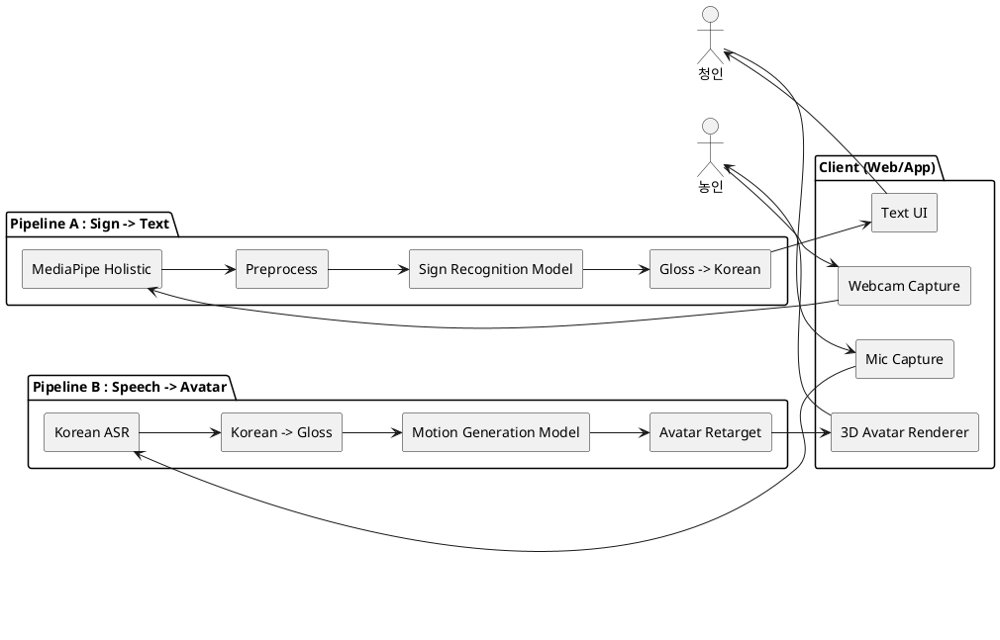
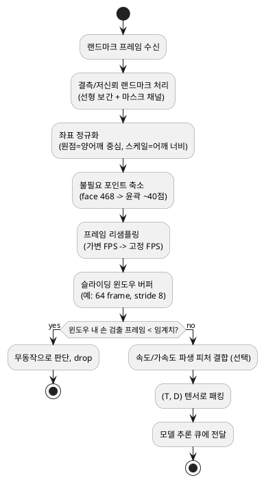
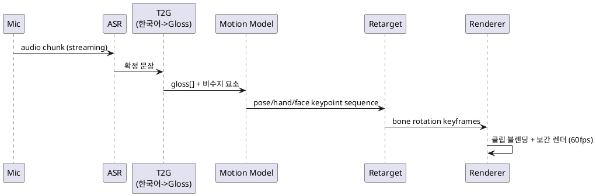

# KSignBridge 아키텍처

실시간 한국어 ↔ 한국수어(KSL) 양방향 번역기.
두 개의 독립 파이프라인으로 구성된다.

| 파이프라인 | 방향 | 입력 → 출력 |
|-----------|------|-------------|
| **A. Sign → Text** | 수어 → 한국어 | 영상 → MediaPipe Holistic → 전처리 → 모델 → 텍스트 |
| **B. Speech → Avatar** | 한국어 → 수어 | 음성 → 모델 → 3D 아바타 렌더링 |

---

## 1. 전체 구성



---

## 2. 파이프라인 A — 수어 영상 → 한국어 텍스트

### 2.1 단계

| # | 단계 | 처리 내용 | 비고 |
|---|------|-----------|------|
| 1 | **Capture** | 웹캠 프레임 스트림 (고정 FPS, 예: 30fps) | RGB, 720p 권장 |
| 2 | **MediaPipe Holistic** | 프레임별 랜드마크 추출: pose 33 · 왼손 21 · 오른손 21 · face 468 | `(x, y, z, visibility)` |
| 3 | **Preprocess** | 아래 2.2 참고 | 슬라이딩 윈도우 단위 |
| 4 | **Sign Recognition Model** | 랜드마크 시퀀스 → gloss(표제어) 시퀀스 | CSLR, CTC 디코딩 |
| 5 | **Gloss → Korean** | KSL gloss 열 → 자연스러운 한국어 문장 | seq2seq / 소형 LLM 후편집 |
| 6 | **Output** | 텍스트 스트림 (부분 결과 + 확정 결과) | 자막 형태로 표시 |

### 2.2 전처리 파이프라인



- **정규화**: 카메라 거리·위치 불변성 확보. translation·scale 제거, 필요 시 회전 보정.
- **결측 처리**: 손이 프레임 밖/가려짐 → 이전 값 보간 후 별도 mask 채널로 결측 표시.
- **윈도우**: 실시간성을 위해 전체 문장을 기다리지 않고 슬라이딩 윈도우로 스트리밍 추론.
- **정합**: 학습 시 [KS_DATA](data/KS_DATA.md)의 형태소 JSON `start`/`end` 구간으로 프레임-gloss 라벨 정렬.

### 2.3 모델

| 구성 | 후보 |
|------|------|
| 시퀀스 인코더 | Temporal Transformer / ST-GCN / MS-TCN |
| 디코딩 | CTC (연속 수어, 세그먼테이션 불필요) |
| gloss→text | mBART / KoBART fine-tune, 또는 LLM few-shot 후편집 |
| 서빙 | ONNX Runtime / TorchScript, GPU 1개 기준 스트리밍 추론 |

---

## 3. 파이프라인 B — 음성 → 3D 아바타

### 3.1 단계

| # | 단계 | 처리 내용 | 비고 |
|---|------|-----------|------|
| 1 | **Mic Capture** | 마이크 오디오 스트림 (16kHz mono) | VAD로 발화 구간 분리 |
| 2 | **Korean ASR** | 음성 → 한국어 텍스트 | Whisper / 스트리밍 STT |
| 3 | **Korean → Gloss** | 한국어 문장 → KSL gloss 열 + 비수지 요소(문형/표정) | 규칙 + seq2seq |
| 4 | **Motion Generation Model** | gloss 열 → 상체·손·표정 키포인트/포즈 시퀀스 | 사전 모션 클립 조합 또는 생성 모델 |
| 5 | **Avatar Retarget** | 키포인트 → 아바타 리그(본) 각도로 리타게팅, 클립 간 블렌딩 | SMPL-X / VRM 리그 |
| 6 | **Renderer** | 3D 아바타 실시간 렌더링 | Three.js(WebGL) / Unity |

### 3.2 흐름



### 3.3 모션 생성 전략

| 방식 | 설명 | 장단점 |
|------|------|--------|
| **사전 클립 기반** | gloss별 캡처 모션 사전 구축 → 조회 후 co-articulation 블렌딩 | 품질 안정, 어휘 확장 비용 큼 |
| **생성 모델** | gloss→pose seq2seq (Transformer/Diffusion) | 유연, 데이터·검증 부담 |
| **하이브리드** | 핵심 어휘는 클립, 전이/굴절은 생성 보정 | 실무 권장 |

- 비수지 요소(눈썹·고개·입모양)는 face 블렌드셰이프로 별도 트랙 제어.
- [KS_DATA](data/KS_DATA.md) 키포인트 JSON(pose 25 · hand 21×2 · face 70)을 모션 학습·클립 소스로 사용.

---

## 4. 공통 구성요소

| 구성 | 역할 |
|------|------|
| **Stream Bus** | 프레임/오디오 청크 큐잉, 백프레셔 처리 (asyncio queue / WebSocket) |
| **Inference Service** | 모델 로딩·배치·워밍업, A/B 모델 각각 엔드포인트 |
| **Session Manager** | 대화 세션, 방향 전환(수어↔음성), 부분/확정 결과 상태 |
| **Monitoring** | 구조화 로깅(structlog) + PLG 스택 (`docs/guides/MONITORING.md`) |

### 지연 예산 (목표)

| 파이프라인 | 목표 end-to-end | 주요 병목 |
|-----------|-----------------|-----------|
| A. Sign → Text | < 500 ms (윈도우 확정 기준) | Holistic 추출, 시퀀스 모델 |
| B. Speech → Avatar | < 800 ms (발화 종료 → 아바타 시작) | ASR 확정, 모션 생성 |

---

## 5. 기술 스택 (초안)

| 레이어 | 후보 |
|--------|------|
| 랜드마크 추출 | MediaPipe Holistic (Python / JS) |
| 모델 | PyTorch → ONNX Runtime |
| ASR | faster-whisper (스트리밍) |
| 백엔드 | Python (asyncio), WebSocket |
| 렌더링 | Three.js + VRM, 또는 Unity |
| 로깅/모니터링 | structlog + Loki/Alloy/Grafana |

---

## 6. 디렉토리 구조 (제안)

```
src/
├── capture/          # 웹캠·마이크 입력
├── holistic/         # MediaPipe Holistic 래퍼
├── preprocess/       # 정규화·윈도잉·피처 (파이프라인 A)
├── models/
│   ├── sign2gloss/   # CSLR 모델
│   ├── gloss2text/   # gloss → 한국어
│   ├── text2gloss/   # 한국어 → gloss
│   └── gloss2motion/ # 모션 생성
├── asr/              # 한국어 STT
├── avatar/           # 리타게팅·블렌딩
├── serving/          # 추론 서비스·스트림 버스
└── monitoring/       # 로깅 (기존)
```
